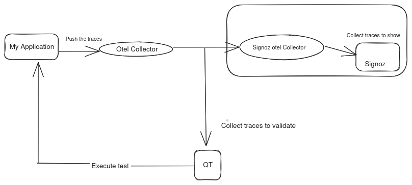

# Quality Trace
Quality Trace is a trace-based testing tool for building integration and end-to-end tests in minutes using your OpenTelemetry traces. Assert against your trace data at every point of a request transaction.

## Table of Contents
- [How QT works](#how-QT-works)
- [Architecture diagram](#architecture-diagram)
- [How to install and run QT](#how-to-install-and-run-QT)

## 🤔 How does QT works?

1. Pick an endpoint to test.
2. Run a test, and get the trace.
3. The trace is the blueprint of your system under test. It shows all the steps the system has taken to execute the request.
4. Add assertions on different services, checking return statuses, data, or even execution times of a system.
5. Run the tests.

Once the test is built, it can be run automatically as part of a build process. Every test has a trace attached, allowing you to immediately see what worked, and what did not, reducing the need to reproduce the problem to see the underlying issue.We can able to see the traces in signoz ui.

## Architecture diagram



## How to install and run QT

#### Prerequisites
* A Kubernetes cluster 
* Helm binary

#### Prepare Namespace

This command will create a new **namespace** for your cluster.

```bash
kubectl create namespace qt
```

`

## Install the QT Server

` 

Install QT with Helm. The QT Helm charts are located 

```bash
helm repo add qt https://intelops.github.io/tracetest
helm repo update 

helm install qt qt/tracetest
```

## Open QT

## How to configure the server url

```bash
qt configure
```
Enter the server url.

**Build tests in minutes**.
We should use yaml file for testing the http application from the cli.
## 📂 What does the test definition file look like?

The QT [test definition files] are written in a simple YAML format. You can write them directly or build them graphically via the UI. Here is an example of a test which:

- Executes `POST` against the `/users` endpoint.
- Verifies that the HTTP blocks return a `201` status code.

```yaml
type: Test
spec:
id: tA_Of67IR
name: user
trigger:
type: http
httpRequest:
method: POST
url: http://user.qtapp.svc.cluster.local:8080/users
body: "{\"user_name\":\"meera\",\"account\":\"nokia\",\"id\":20}"
headers:
- key: Content-Type
value: application/json
specs:
- selector: span[tracetest.span.type="http"]
name: "All HTTP Spans: Status code is 201"
assertions:
- attr:http.status_code = 201
```


## 🤖 How to run an automated test?

Save a test definition file above as `users.yaml`. Use the CLI to run a test.

```bash
qt run test --file /path/to/users.yaml
```

